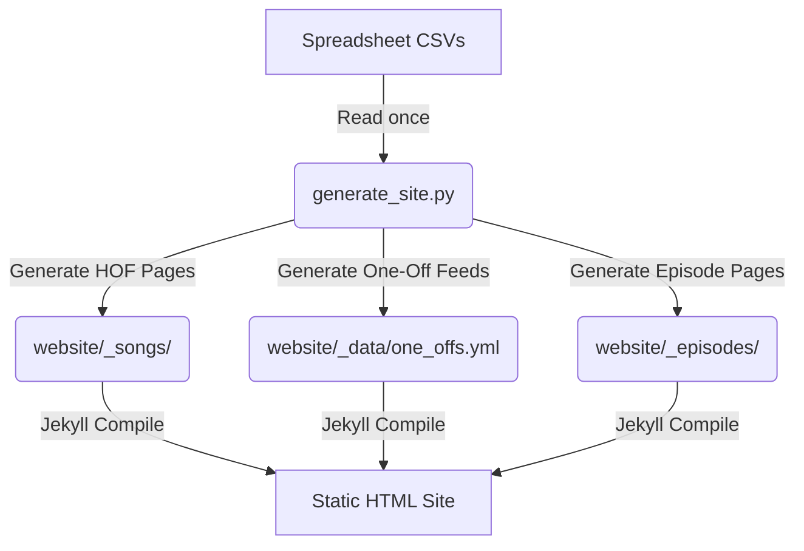

# Friday Jazz Happy Hour Tools & Website

This repository contains two main utilities:
1.  **Friday Jazz Happy Hour Jekyll Website**: A static archive site displaying show episodes, setlists, and song history.
2.  **YouTube Chapter Generator**: An automated Shazam/ML-based audio recognition tool to detect song start times in recording files.

---

## 🎷 Part 1: Friday Jazz Happy Hour Jekyll Website

The Jekyll website acts as a public-facing archive of all historical Friday Jazz Happy Hour performances. It compiles song play statistics, categorizes songs (rotation "Hall of Fame" vs "One-Off" jams), and houses detailed setlists with timestamp links for every stream episode.

### 1. Structure & Data Flow



#### A. Data Sources (CSVs in root)
-   **`FJHH songs - Songs.csv`**: The master song-play log. Maps every song performance to a `Date`, `Epi #`, `Song #`, `Name`, `Tempo`, `Style`, `Composer`, and video timestamp `Offset` (seconds).
-   **`FJHH songs - Episodes.csv`**: Show metadata. Contains links, tip jar charities, themes, clothing info, and stream notes.
-   **`FJHH songs - Hall of Fame.csv`**: The "Regular Rotation" list of songs. Defines the canonical song names, style classifications, composer details, and "Ready" practice ratings.

#### B. Compilation & Orchestration (`generate_site.py`)
This unified python script acts as the database compiler. In a single execution, it:
1.  Loads all three CSV datasets into memory.
2.  Resolves canonical dates and filters out rerun streams.
3.  Generates individual markdown files for Hall of Fame songs in `website/_songs/` (with play histories).
4.  Consolidates non-rotation "One-Off" songs and writes them to YAML data feeds:
    -   `website/_data/one_offs.yml` (play count summaries)
    -   `website/_data/one_offs_performances.yml` (every individual performance)
5.  Generates individual episode pages in `website/_episodes/` detailing the setlist, timestamps, shirt choices, tip jars, and notes.

#### C. Jekyll Theme & Layouts (`website/_layouts/`)
-   `default.html`: The base website wrap. Includes navbar links, custom Google Fonts, CSS variables, and the Glassmorphic Mailchimp signup widget.
-   `episode.html`: Episode template. Displays the setlist table. **Note**: If a title slide image exists (e.g. `website/assets/images/title-slides/episode-XXX.png`), it hides the textual title block to avoid visual clutter.
-   `song.html`: Rotation song detail layout displaying play history table.
-   `songs-list.html` & `one-offs-list.html`: Presentation grids displaying HOF songs and One-Offs. Includes instant client-side searching and sorting scripts.

---

### 2. Website Update Workflow

To update the website after playing new shows:

1.  **Download Spreadsheets**: Export `Songs`, `Episodes`, and `Hall of Fame` from your Google Sheets as CSVs and save them in the root directory (overwriting the old ones).
2.  **Clean YouTube URLs (Optional)**: If you manually added stream URLs in raw format (e.g., with query parameters or playlist ids), you can run the standardization script:
    ```bash
    python3 scratch/clean_episode_urls.py
    ```
    This formats them into clean `https://youtu.be/VIDEO_ID` links.
3.  **Run Site Generator**:
    ```bash
    python3 generate_site.py
    ```
4.  **Preview Locally**:
    Start the Jekyll server:
    ```bash
    bundle exec jekyll serve
    ```
    *If port 4000 is occupied, release it with: `lsof -ti:4000 | xargs kill -9`*
5.  **Publish to GitHub**:
    ```bash
    git add .
    git commit -m "Update song archives and episodes with latest show data"
    git push
    ```

---

## 🎙️ Part 2: YouTube Chapter Generator

This tool automatically detects song start times in a YouTube live stream recording and generates YouTube-formatted chapter markers (e.g., `03:15 - Song Name`) using a song list from a Google Spreadsheet (local CSV or online Sheet).

### How It Works
1.  **Song List**: The script reads your song list from a local CSV file or fetches it from a public Google Sheet. It parses the list to get the order of the songs for a specific show date (or defaults to the most recent show).
2.  **Scan**: It scans through the video/audio file by extracting short audio clips at set intervals.
3.  **Recognize**: It submits these clips to Shazam's recognition service to identify which song is playing.
4.  **Refine**: Once a song matches, it performs a binary search (halving intervals) to pinpoint the exact transition timestamp within 10 seconds.
5.  **Output**: It generates a formatted list of timestamps and titles ready to copy and paste directly into your YouTube description.

### How to Run

1.  Open your terminal and navigate to the project directory:
    ```bash
    cd /Users/walker/Dropbox/youtube-chapters
    ```
2.  Activate the virtual environment:
    ```bash
    source .venv/bin/activate
    ```
3.  Run the generator script:

    **Option A: Using the local CSV file (Recommended)**
    ```bash
    python3 chapter_generator.py "/path/to/livestream_recording.mp4" --csv-path "FJHH songs - Songs.csv"
    ```

    **Option B: Directly fetching from Google Sheets**
    *Note: First share your Google Sheet as "Anyone with the link can view (Viewer)", and copy the Sheet ID from the URL.*
    ```bash
    python3 chapter_generator.py "/path/to/livestream_recording.mp4" --sheet-id "YOUR_SPREADSHEET_ID"
    ```

    **Option C: For live original improvisations (Bypassing Shazam)**
    If you are doing original live improvisations or playing songs that cannot be recognized by Shazam, add the `--improv` flag. This uses a local machine learning (K-Means clustering) pipeline to distinguish talking/silence from continuous musical improvisation, automatically mapping the detected music segments to the song list:
    ```bash
    python3 chapter_generator.py "/path/to/livestream_recording.mp4" --csv-path "FJHH songs - Songs.csv" --improv
    ```

### Additional Options

*   **Handle a Musical Intro at the Start (`--skip-start`)**:
    If you play a musical intro or warm up for the first few minutes, you can tell the script to skip analyzing the first $X$ seconds (e.g., skip the first 3 minutes = 180 seconds):
    ```bash
    python3 chapter_generator.py "/path/to/livestream_recording.mp4" --csv-path "FJHH songs - Songs.csv" --improv --skip-start 180
    ```

*   **Filter Out Short Jams/Tuning (`--min-duration`)**:
    To ignore short music blocks (like a 30-second sound check or short jam) and only target actual songs, increase the minimum duration (in seconds) required for a block to be considered a song (default is 90 seconds):
    ```bash
    python3 chapter_generator.py "/path/to/livestream_recording.mp4" --csv-path "FJHH songs - Songs.csv" --improv --min-duration 120
    ```

*   **Align Local Recording with YouTube Stream (`--offset`)**:
    Sometimes, the raw local video file has a pre-roll or extra recording buffer compared to the final trimmed stream published on YouTube. You can use `--offset` (in seconds) to shift all generated timestamps so they align perfectly with the YouTube video timeline:
    ```bash
    # Shift all timestamps back by 21 seconds
    python3 chapter_generator.py "/path/to/livestream_recording.mp4" --csv-path "FJHH songs - Songs.csv" --improv --offset -21.0
    ```

*   **Select Improvisation Detection Method (`--improv-method`)**:
    By default, improvisation mode uses `silence` segmentation which detects the pauses between songs. You can also specify `kmeans` to use unsupervised machine learning features (Zero Crossing Rate and loudness variation):
    ```bash
    # Use K-Means clustering instead of silence boundary detection
    python3 chapter_generator.py "/path/to/livestream_recording.mp4" --csv-path "FJHH songs - Songs.csv" --improv --improv-method kmeans
    ```

*   **Increase Start Time Accuracy (`--chunk-size`)**:
    By default, the script analyzes the video in 1-second chunks. To get sub-second precision (e.g. 0.5-second accuracy), specify a smaller chunk size:
    ```bash
    # Recommended for highest precision
    python3 chapter_generator.py "/path/to/livestream_recording.mp4" --csv-path "FJHH songs - Songs.csv" --improv --chunk-size 0.5
    ```

*   **Specify a Show Date**:
    If your spreadsheet lists songs for multiple weeks, specify which date you want to extract songs for (otherwise, it will default to the last/most recent date in the sheet, e.g. `6/26/2026`):
    ```bash
    python3 chapter_generator.py "/path/to/livestream_recording.mp4" --csv-path "FJHH songs - Songs.csv" --date "6/26/2026"
    ```
    *(Note: You can input the date in either `M/D/YYYY` or `YYYY-MM-DD` formats; the script normalizes them automatically).*

*   **Change Scan Interval (Shazam Mode Only)**:
    By default, in Shazam mode it checks the audio every 30 seconds to speed up scanning. If songs are shorter or you want to scan differently, you can change the interval (in seconds):
    ```bash
    python3 chapter_generator.py "/path/to/livestream_recording.mp4" --csv-path "FJHH songs - Songs.csv" --interval 15
    ```

*   **Specify a Tab/Sheet Name (Google Sheets Only)**:
    If your songs are on a specific tab in the online workbook, use `--sheet-name`:
    ```bash
    python3 chapter_generator.py "/path/to/livestream_recording.mp4" --sheet-id "YOUR_ID" --sheet-name "Shows 2026"
    ```

*   **Bill's Current invocation**:
    ```bash
    .venv/bin/python chapter_generator.py "/Users/walker/Documents/Ecamm Live Recordings/Bill Walker on 2026-07-17 at 17.00.12.mov" --csv-path "FJHH songs - Songs.csv" --skip-start 180 --min-duration 120``
    ```
